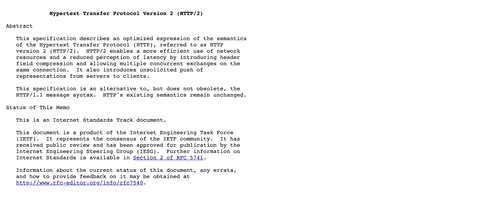

# mac-ocr-translator

## installation

- `git clone https://github.com/devcrema/mac-ocr-translator.git`
- `cd mac-ocr-translator`
- `pip install -r requirements.txt`
- `brew install imagemagick`
- `brew install tesseract`
- `brew install tesseract-lang`
- preference - 보안 및 개인정보보호 - 손쉬운 사용 - add this program (현재 사용중인 termianl or IDE)
- preference - 보안 및 개인정보보호 - 화면 기록 - add this program (현재 사용중인 termianl or IDE)
- python3 ./main.py

## How to use

- `cmd` + `shift` + `1` : ocr + translate (eng -> kor)
- `cmd` + `shift` + `2` : ocr + pronunciation (eng)

### TODO

- [x] python key event listener for screenshot
- [x] python key event that trigger screenshot
- [x] apply ocr
- [x] translator (https://github.com/ssut/py-googletrans)
- [x] show result
- [x] pronunciation
- [ ] better performance on pronunciation
- [ ] python running in background and launch at login
- [ ] gui library
- [ ] preference
